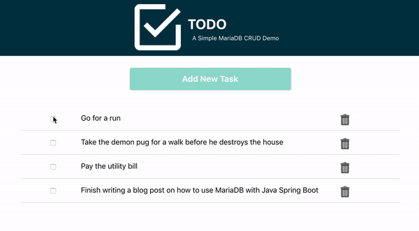

# TODO App

**TODO** is a web application that introduces you to the power, performance, and simplicity of [MariaDB](https://mariadb.com/products/).

    <kbd>
        
    </kbd>

This application is made of two parts:

* frontend (Client)
    - web UI that communicates with REST endpoints available through an API app (see below).
    - in the [frontend](srv/frontend) folder.
    - a simple JS app
* backend (API)
    - uses the [MariaDB Node.js Connector](https://github.com/mariadb-corporation/mariadb-connector-nodejs) to connect to MariaDB.
    - is a Node.js project located in the [backend](src/backend) folder.
